# travellingDog
#### unity2D game
  
  
  
## Design : Sprites
using **piskel** free creating sprite https://www.piskelapp.com/  
draw sprites(16px X 16px)  
### sample  

    

## Scenes  
two **Scenes**  
1. stage select  
user can select stage.  
if user passed each stage, it will be shown light blue  

  
2. each stage game  
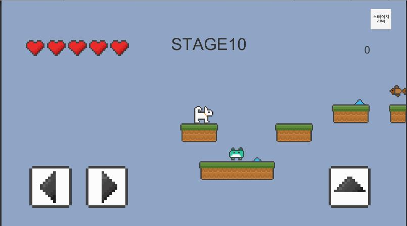 
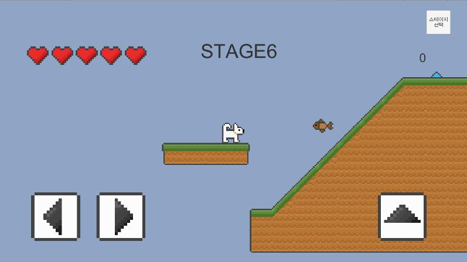 
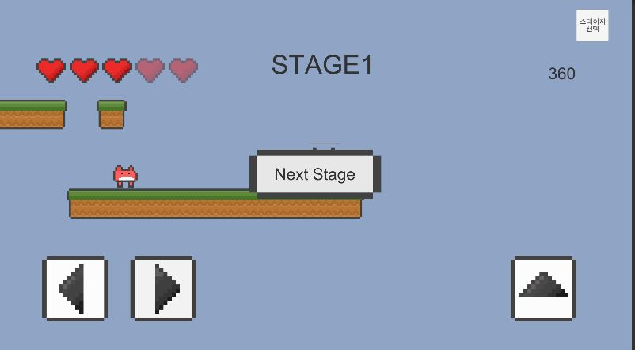 
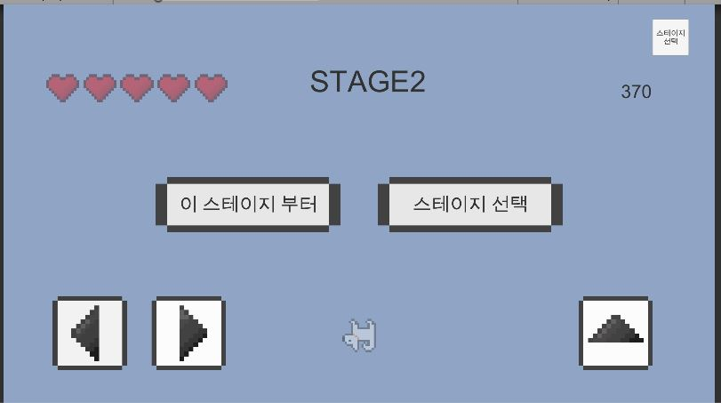   

## Player
player is motivated my real dog  

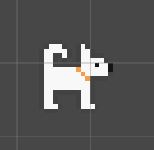  
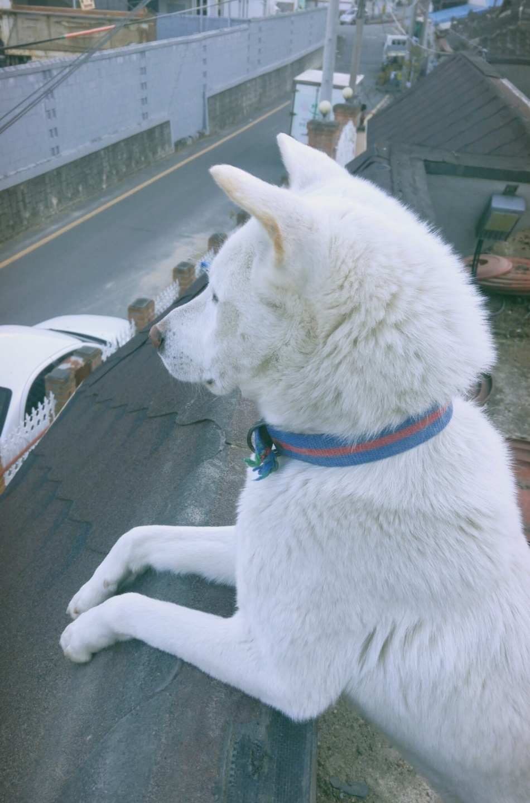   

## items
there many items to help user  
1. jumpBall : jumpPower is increased for 3 seconds  
2. jumpItem : jumpPower is increased when jumping on this item  
3. life : life is increased  
4. MoveItem : item can be moved by user, then user can use this *flying leap*  
5. Bone : finish   

## Points
1. bronzefish : 10points  
2. silverfish : 50points  
3. goldfish : 100points  
4. monster : 200points  

## monsters and hurdle
1. monster : when user collide this, user's life is decreased. But user can kill this by stepping on
2. monsterCat : when user collide this, user's life is decreased. But user can kill this by stepping on
3. hurdle : when user collide this, user's life is decreased. 

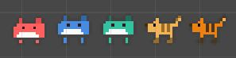
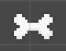
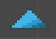
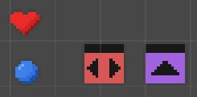
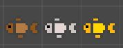    

