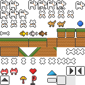
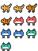
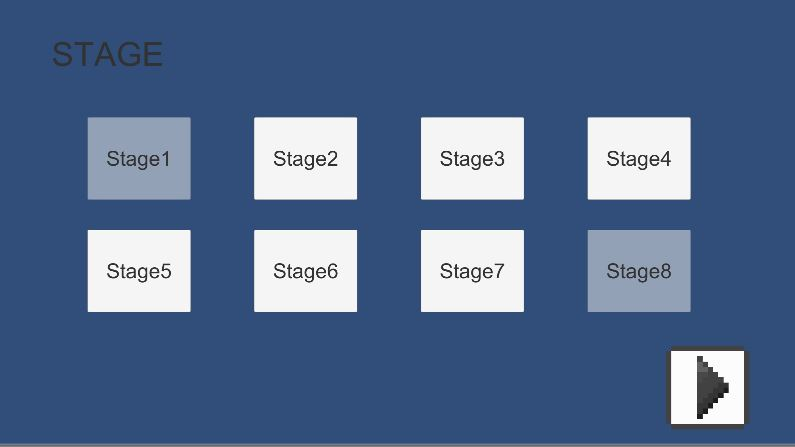
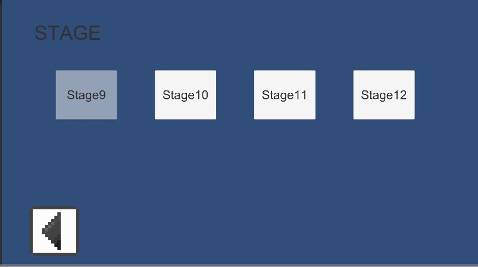

# travellingDog
#### unity2D game
  
  
  
## Design : Sprites
using **piskel** free creating sprite https://www.piskelapp.com/  
draw sprites(16px X 16px)  
### sample  

    

## Scenes  
two **Scenes**  
1. stage select  
user can select stage.  
if user passed each stage, it will be shown light blue  
{: width="200" height="100"}  
{: width="200" height="100"}  
 
2. each stage game  

